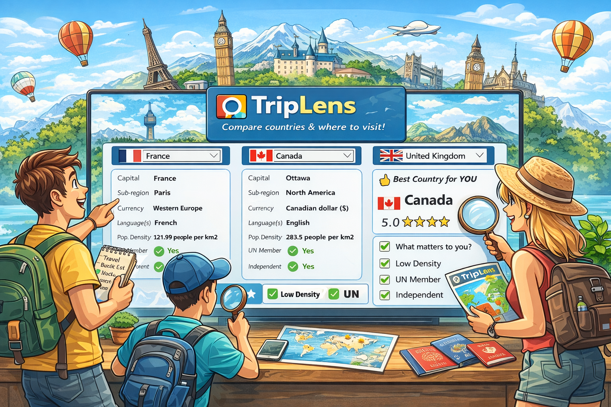
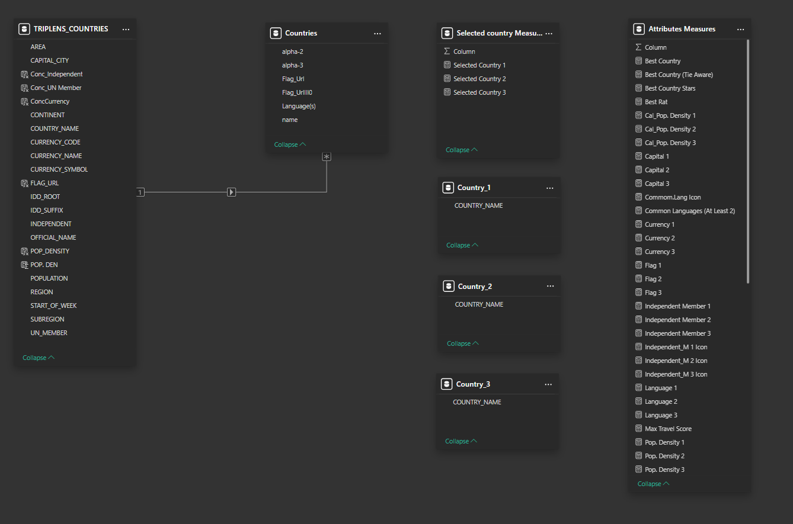
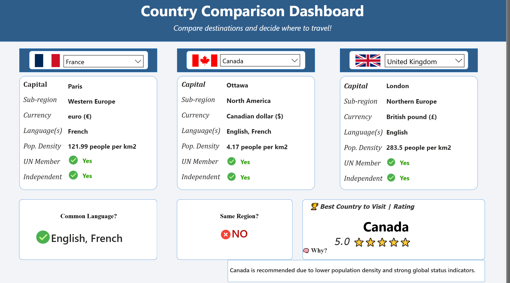

# 🌍 TripLens: Interactive Travel Comparison & Scoring Dashboard

  

---

## Business Overview
**TripLens Global** is a forward-thinking travel and tourism analytics company dedicated to transforming how individuals and organizations explore destinations worldwide. Founded in 2023, the company delivers data-driven insights that empower travellers and travel agencies to make informed, efficient, and personalized travel decisions.

At its core, TripLens Global integrates advanced data engineering and analytics techniques to collect, process, and present comprehensive country-level information. Its platform centralizes critical travel data—including regions, languages, currencies, time zones, and neighbouring countries—into a single, user-friendly interface.

---

## Business Problem
As the global travel industry expands, the demand for accessible, accurate, and comprehensive country-level data continues to rise. The TripLens Global Countries Explorer project addresses several critical challenges:

**1. Data Accessibility:**

Transforming complex and diverse datasets into a clear, intuitive format that can be easily understood by both individual travellers and travel agencies.

**2. Data Integration**

Aggregating and synchronizing data from multiple sources, including public APIs and government databases, while ensuring consistency, accuracy, and real-time updates.

**3. Scalability**

Designing a system capable of handling increasing data volume and user demand without compromising performance, responsiveness, or reliability.

---

## 📌 Project Objectives
This TripLens Global Countries Explorer project is designed to deliver a scalable, data-driven solution for travel insights. The primary objectives include:

**1. Develop a Scalable Data Pipeline**

Design and implement a robust data pipeline using Python, DBT, and Apache Airflow to efficiently collect, transform, and manage data from multiple sources.

**2. Data Processing and Integration**

Aggregate and standardize country-level data from APIs, government databases, and open data platforms to create a unified and reliable dataset for analysis.

**3. Enhance User Experience**

Deliver clear and comprehensive country profiles by presenting key information—such as region, language, currency, and neighbouring countries—in an intuitive and user-friendly format.

**4. Build Interactive Dashboards and Reports**

Develop dynamic and customizable dashboards using Power BI, enabling users to explore travel insights, monitor trends, and make data-driven decisions in real time.

---

## 🎯 Key Features

### 🔄 Dynamic Country Comparison

* Compare up to 3 countries simultaneously
* View key attributes like capital, currency, population density, language, sub-region, UN membership, and Independent status.

### 🧠 Intelligent Scoring System

* Custom DAX-based scoring engine
* Weighted logic using conditional rules
* Real-time recalculation

### 🌍 Language Matching Engine

* Identifies:

  * Languages shared across all countries
  * Languages shared by at least 2 countries
* Handles multi-language countries

### 🏆 Best Country Recommendation

* Automatically selects the best country based on score
* Assign star rating (5-star rating)
* Handles tie scenarios intelligently

### 🎨 Enhanced UX/UI

* Dynamic flags (API-driven)
* Icon-based indicators (✅ ❌)
* Clean, modern layout for storytelling

---

## Data Dictionary and Modelling

  

---

## Approach & Methodology
This project was developed entirely using **Snowflake and Microsoft Power BI**, covering the full analytics workflow — from data cleaning and transformation to modeling, analysis, and visualization. The objective was to help users compare countries based on travel-relevant factors such as population density, UN membership, independence, and more. 

The project transforms raw country-level data into a dynamic, user-driven decision tool, allowing users to select preferences and instantly see the best travel options.

---

## 🧱 Data Modeling Approach

* Created a normalized country dataset
* Created a disjointed table for selected countries
* Handled:

  * Multi-language fields
  * Country code standardization (ISO)
* Built reusable dimension tables

---

## 🛠️ Tech Stack

* **Snowflakes**
* **Power BI**
* **DAX (Data Analysis Expressions)**
* **Power Query (ETL)**
* **REST Countries API**
* **Data modeling (one-many relationship)**

---

## 📊 Data Sources

* REST Countries API
* Open-source country datasets

---

## ⚡ Key DAX Concepts Used

* CALCULATE / FILTER
* SELECTEDVALUE
* SWITCH(TRUE())
* INTERSECT / UNION
* CONCATENATEX
* Dynamic measures
* Table constructors

---

## 📸 Screenshots

  

---

## 🚀 Challenges & Solutions

| Challenge                    | Solution                          |
| ---------------------------- | --------------------------------- |
| Multi-language in one column | Split into rows using Power Query |
| Country name mismatches      | Created normalized keys           |
| Dynamic flag rendering       | Used URL-based images             |

---

## 📈 Business Value

This dashboard simulates a real-world decision tool by:

* Enabling personalized travel insights
* Supporting data-driven recommendations
* Demonstrating scalable analytics design

---

🔗 [View the Live Dashboard](https://app.fabric.microsoft.com/view?r=eyJrIjoiZTNlY2M2ZDYtOTc4Ny00MTljLWIxZDktYjY4YTJjMDNkYTdiIiwidCI6ImZmMGYzZTNhLTNlNTMtNDU0Zi1iMmI1LTZjNjg3NTNiOGVlNCJ9)

---

## 🔮 Future Improvements

* Add cost-of-living and safety metrics
* Integrate weather/climate data
* Expand scoring model with weights
* Deploy as a web app
* Travel preference toggle
  * where users can choose what matters most:
    * 🌿 Low Population Density
    * 🏛 UN Membership
    * 🏳 Independence
* Scores update dynamically based on selected preferences
---

## 🧠 Key Learnings
- Importance of proper data modeling (atomic columns)
- Building dynamic user-driven metrics using DAX
- Handling real-world data inconsistencies
- Designing dashboards for decision-making, not just visuals

## 👨‍💻 Author

**David Okeleye**

Data Analyst | Healthcare Analytics | Business Intelligence (SQL, Tableau, Power BI, Excel) | Predictive Modeling & Data Visualization
- 💼 **LinkedIn:** (https://www.linkedin.com/in/david-okeleye001/)
- 📧 **Email:** okeleyedavid2021@gmail.com
- 🌐 **Portfolio:** https://bit.ly/3N5c1p7
- 🐙 **GitHub:** https://github.com/olavidz01-dev

## Disclaimer
This project is for portfolio and educational display only.

---

## ⭐ If you found this useful

Give it a star ⭐ and feel free to contribute on how to make this a truly robust decision-making tool!
